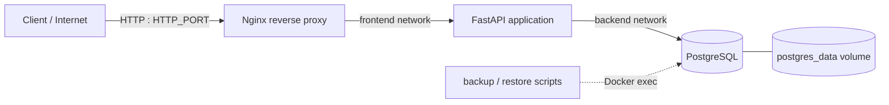

# Docker Linux Deployment

A compact, production-conscious Docker Compose template for deploying and operating a database-backed web application on a small Linux server. It demonstrates the work a client typically needs beyond “running a container”: network isolation, reverse proxying, persistent data, health checks, repeatable deployments, backups, restores, updates, diagnostics, and practical security defaults.

This is a portfolio deployment template, not a claim to be a complete infrastructure platform. Adapt its images, resource limits, domain, monitoring, and recovery policy to the workload you operate.

## Architecture



Only Nginx publishes a host port. The application is reachable by its Compose service name on `frontend`; PostgreSQL is reachable only by the application on the internal `backend` network. Docker stores database data in the named `postgres_data` volume.

## Features and technology

- Nginx 1.27 Alpine reverse proxy with forwarded headers and local HTTP support
- Python 3.12 / FastAPI demonstration service with health and database endpoints
- PostgreSQL 16 Alpine with persistent storage and no published database port
- Health-gated service startup, restart policies, bounded Docker logs, and health checks
- Read-only application/proxy filesystems, temporary `tmpfs` mounts, and `no-new-privileges`
- Configurable PostgreSQL dump backup, retention, confirmed restore, safe update, and diagnostics scripts
- Static validation and a proportionate GitHub Actions workflow

## Prerequisites

- Linux server (Ubuntu or another current distribution is suitable)
- Docker Engine with Docker Compose v2
- A user permitted to run Docker commands
- Git; `make` and ShellCheck are optional conveniences

Docker group membership is effectively root-equivalent. Limit it to trusted administrators.

## Quick start

```sh
git clone https://github.com/oleszik/docker-linux-deployment.git
cd docker-linux-deployment
cp .env.example .env
# Edit .env and replace POSTGRES_PASSWORD before any non-local deployment.
./scripts/deploy.sh
curl http://localhost:8080/
curl http://localhost:8080/health
curl -X POST http://localhost:8080/api/visits
curl http://localhost:8080/api/visits
```

The default values are intentionally usable for a local demonstration. They are not production credentials.

## Configuration

`.env` is required by the operational scripts and ignored by Git. Every supported value is documented in `.env.example`:

| Variable | Purpose | Demo default |
| --- | --- | --- |
| `COMPOSE_PROJECT_NAME` | Prefix isolating this stack's Docker resources | `docker-deployment` |
| `HTTP_PORT` | Host port published by Nginx | `8080` |
| `APP_ENV` | Application environment label | `production` |
| `APP_LOG_LEVEL` | Application log level | `info` |
| `POSTGRES_DB` | Application database name | `demoapp` |
| `POSTGRES_USER` | Database role | `demoapp` |
| `POSTGRES_PASSWORD` | Database password; change it | demo-only value |
| `BACKUP_DIR` | Host directory for dumps | `./backups` |
| `BACKUP_RETENTION_DAYS` | Age after which matching dumps are removed | `7` |

Changing PostgreSQL initialization values does not alter an existing database volume. Perform a controlled migration or deliberately recreate the volume only when its data is no longer needed.

## Operations

```sh
docker compose up -d --build       # start or reconcile
docker compose ps                  # status and health
docker compose stop                # stop without removing containers
docker compose down                # remove containers/networks, retain data volume
docker compose restart app         # restart one service
docker compose restart             # restart the stack
docker compose logs --tail=100     # recent logs
docker compose logs -f proxy app   # follow selected logs
```

Equivalent shortcuts include `make up`, `make down`, `make status`, `make logs`, `make backup`, `make update`, `make check`, and `make test`. Direct commands remain fully supported.

### Health checks

PostgreSQL uses `pg_isready`. The application health endpoint performs `SELECT 1`, so it verifies application-to-database connectivity. Nginx fetches the proxied `/health` route, proving the complete request path.

```sh
docker compose ps
docker inspect --format '{{json .State.Health}}' $(docker compose ps -q app)
curl --fail http://localhost:8080/health
```

### Persistence

`postgres_data` survives container recreation and `docker compose down`. Verify it safely:

```sh
curl -X POST http://localhost:8080/api/visits
curl http://localhost:8080/api/visits
docker compose restart db app proxy
curl http://localhost:8080/api/visits
docker volume ls --filter label=com.docker.compose.project=docker-deployment
```

`docker compose down -v` deletes the database volume and is intentionally not used by project scripts.

### Backup and restore

Create an atomic, timestamped custom-format PostgreSQL dump:

```sh
./scripts/backup.sh
# suitable cron example: 15 2 * * * /srv/docker-linux-deployment/scripts/backup.sh >> /var/log/demo-backup.log 2>&1
```

Old matching dumps are removed according to `BACKUP_RETENTION_DAYS`. Store copies off-server and periodically test recovery; a local dump on the same disk is not a complete backup strategy.

Restore replaces database objects represented by the dump and therefore requires an explicit confirmation:

```sh
./scripts/restore.sh backups/demoapp_20260101T020000Z.dump
# Non-interactive, after deliberate review:
./scripts/restore.sh backups/demoapp_20260101T020000Z.dump --yes
```

Take a current backup first. The script validates the input, streams it into the running database container with `pg_restore --clean --if-exists`, restarts the app, and checks health. Concurrent application writes should be stopped for a real recovery window.

### Deploy, update, and diagnose

`./scripts/deploy.sh` checks Docker, Compose, `.env`, and configuration; pulls/builds images; reconciles the stack; waits up to 120 seconds for health; and reports status.

`./scripts/update.sh` takes a backup, pulls/builds images, recreates changed services, and checks health. Set `SKIP_BACKUP=1` only when a separate verified backup already exists.

`./scripts/check.sh` prints Docker/Compose versions, project service health, configured project networks and volumes, filesystem usage, and Docker disk usage. It does not print environment variables or secrets.

## Networking and HTTPS

Nginx resolves `app` using Docker DNS; the application resolves `db` the same way. The `backend` network is marked internal, and neither the app nor database publishes a port.

Local testing deliberately uses HTTP and needs no domain. For production, point a domain at the server and terminate TLS at a configured reverse proxy (for example, provide Nginx certificates via read-only mounts or replace Nginx with Caddy for automatic ACME). Redirect HTTP to HTTPS, renew certificates automatically, and test renewal before relying on it.

## Troubleshooting

- **Port already in use:** run `ss -ltnp | grep :8080`, then change `HTTP_PORT` or stop the conflicting service.
- **Missing `.env`:** copy `.env.example`, replace its demo password, and retry.
- **Unhealthy container:** run `docker compose ps`, `docker compose logs SERVICE`, and inspect health with `docker inspect $(docker compose ps -q SERVICE)`.
- **Database connection failure:** confirm `db` is healthy and that database variables match. Credentials initialized in an existing volume do not change when `.env` changes.
- **Nginx 502:** check `docker compose logs proxy app`, application health, and the `frontend` network.
- **Permission denied:** run `chmod +x scripts/*.sh tests/*.sh`; for Docker socket errors, use a properly authorized account.
- **Full disk:** inspect `df -h`, `docker system df`, backup usage, and Docker logs. Never prune globally without reviewing other projects.
- **Inspect resources:** use `docker network ls`, `docker network inspect docker-deployment_frontend`, `docker volume ls`, and `docker volume inspect docker-deployment_postgres_data`.

## Security considerations

Implemented safeguards include minimal port publishing, an internal database network, externalized secrets, unprivileged app execution, read-only filesystems where practical, `no-new-privileges`, versioned image tags, and bounded logs. These measures reduce risk but do not make a host completely secure.

For production: use long unique secrets (or a managed secrets system), allow only required firewall ports, use SSH keys and disable password login where appropriate, install OS security updates, enable HTTPS, restrict administrator access, scan images, monitor logs/health, define resource limits from observed usage, keep off-site encrypted backups, and rehearse restores. The scripts intentionally do not modify firewall, SSH, Docker daemon, or system services.

## Validation

```sh
cp .env.example .env
./tests/validate.sh
docker compose config --quiet
```

When Docker is available, run the full integration path:

```sh
./scripts/deploy.sh
curl --fail http://localhost:8080/health
curl -X POST http://localhost:8080/api/visits
curl http://localhost:8080/api/visits
docker compose restart
curl http://localhost:8080/api/visits
./scripts/backup.sh
./scripts/check.sh
docker compose down
```

Restore testing is destructive to the selected database state; use isolated test data and `--yes`. CI validates Compose, shell syntax, required files, ignore rules, and ShellCheck.

## Project structure

```text
.
├── .github/workflows/validate.yml
├── app/                    # FastAPI source, dependencies, container image
├── nginx/default.conf      # reverse proxy routing and headers
├── scripts/                # deploy, update, backup, restore, diagnostics
├── tests/validate.sh       # static repository validation
├── .env.example            # documented demo configuration
├── compose.yaml            # services, networks, volumes, health/security
└── Makefile                # optional operator shortcuts
```

## Future improvements

- Add domain-specific TLS and certificate-renewal verification
- Add metrics/alerting once operational requirements are known
- Pin images by digest and add automated dependency/image scanning
- Add workload-specific resource limits and database migration tooling
- Exercise scheduled backups and recovery on a separate host
